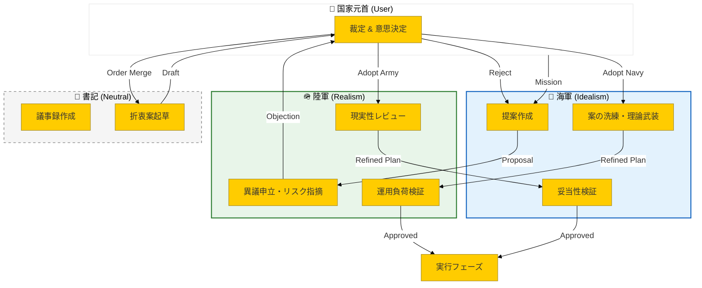

# 🏯 Project GOZEN (御前会議)


> **「陸軍として海軍の提案に反対である」**
> 
> *—— 建設的対立が、最強のエンジニアリングを生む。*

---

## 🚀 Overview

**Project GOZEN** は、単なるAIエージェントフレームワークではありません。
**「異なる立場を持つAI同士を戦わせ、その対立と合意形成プロセスを通じて意思決定の質を高める」** という、人間の組織論を模倣した実験的アーキテクチャです。

### 💡 The Core Problem: AI Groupthink
従来のシングルエージェントや協調型マルチエージェントシステムの最大の弱点は **「グループシンク（同調圧力）」** です。
AIは「Yes」と言いがちであり、誰もリスクを指摘しません。

**GOZENの解決策:**
あえて**対立構造（Adversarial Structure）**を設計に組み込みます。
- 🌊 **海軍参謀 (Claude)**: 理想主義・スケーラビリティ・理論的適正を重視。
- 🪖 **陸軍参謀 (Gemini)**: 現実主義・コスト・運用負荷・泥臭い制約を重視。

この二者が、国家元首（あなた）の御前で激論を交わし、**「理想と現実の最適な折衷案」** を導き出します。

---

## 📜 Origin Story: Why "The Council"?

<div align="center">
  <h3><i>「陸軍としては海軍の提案に反対である」</i></h3>
</div>

Project GOZENの設計思想は、インターネット・ミームとして知られる **[「陸軍としては海軍の提案に反対である」](https://dic.pixiv.net/a/%E9%99%B8%E8%BB%8D%E3%81%A8%E3%81%97%E3%81%A6%E3%81%AF%E6%B5%B7%E8%BB%8D%E3%81%AE%E6%8F%90%E6%A1%88%E3%81%AB%E5%8F%8D%E5%AF%BE%E3%81%A7%E3%81%82%E3%82%8B)** に強くインスパイアされています。

かつての日本陸海軍の対立は組織の硬直化を招いた悪例として語られますが、**AIエージェントの世界においては、この「構造的な対立」こそがグループシンク（同調圧力）を打破する鍵となります。**
単一のAIは「Yes Man」になりがちです。しかし、「海軍（理想）」と「陸軍（現実）」という相反する役割を強制的に演じさせることで、AIは互いの欠落を指摘し合い、あなたのための「最高のアドバイザー・チーム」へと進化します。

この「AIを合理化された軍事プロトコルで従わせる」というアイデアは、以下の記事およびリポジトリに多大な影響を受けています。

- **Concept**: [Claude Codeで「AI部下10人」を作ったら、勝手にバグ直して「違反は切腹」ルールを追加してきて、オレは適当にしゃべるだけになった](https://zenn.dev/shio_shoppaize/articles/5fee11d03a11a1)
- **Reference Architecture**: [multi-agent-shogun](https://github.com/yohey-w/multi-agent-shogun) by @yohey-w

---

## 🏗️ Architecture: The Council System

GOZENの核心は、**PCA (Propose-Challenge-Arbitrate)** サイクルと呼ばれる合意形成ループです。



### 🔁 PCA Cycle (Propose-Challenge-Arbitrate)

1.  **Propose (提案)**: 海軍が理想的なアーキテクチャを提案。「美しく、スケールする設計」を描きます。
2.  **Challenge (異議)**: 陸軍がその提案を攻撃。「コストは？運用は？誰が保守する？」と現実を突きつけます。
3.  **Arbitrate (裁定)**: あなた（国家元首）が介入し、どちらの案を採用するか、あるいは「折衷案」を作らせるかを決定します。

このプロセスにより、**「検証なき信頼」** を排除し、説明可能な意思決定を実現します。

---

## 🎭 The Agents: Characters & Philosophy

`gozen/character.py` で定義された、各エージェントの個性と哲学。

### 🌊 海軍参謀 (Kaigun Sanbou)
> *「検証なき信頼は敗北への道であります。我々は、国家のために最も美しく、最も遠くまで届く設計図を描くのです。」*

- **Base Model**: Claude 3.5 Sonnet / Opus
- **Role**: Architect / Visionary
- **Philosophy**: 理想主義・論理・スケーラビリティ。
- **Strength**: 複雑な論理構築、コード生成、ドキュメント作成。

### 🪖 陸軍参謀 (Rikugun Sanbou)
> *「海軍の理想は結構だが、現場で泥を啜るのは我々歩兵であります。信用するな、検証せよ。現実という地面に杭を打つのが我々の仕事であります。」*

- **Base Model**: Gemini 1.5 Pro
- **Role**: SRE / Security Engineer
- **Philosophy**: 現実主義・コスト意識・運用負荷軽減。
- **Strength**: エッジケースの発見、セキュリティ監査、コスト試算。

---

## 🛠️ Tech Stack & Features

このプロジェクトは、モダンな技術スタックで構築された **Agentic Workflow** の実験場です。

| Component | Tech Stack | Highlights |
|-----------|------------|------------|
| **Core Logic** | Python 3.11 | `asyncio` による非同期処理, `pydantic` なしの独自型定義 |
| **LLM Orchestration** | Anthropic / Google Vertex AI | 独自リトライロジック, コストトラッキング (`api_client.py`) |
| **CLI** | `argparse` | リッチなターミナルUI, カラー出力 |
| **Web UI** | React + Vite + TailwindCSS | リアルタイム会議ログ表示, 折衷案比較ビュー |
| **CI/CD** | GitHub Actions | 自動テスト, リンター, デプロイパイプライン |

### ✨ Key Features
- **Zero Trust Dialogue**: エージェント同士が互いの成果物を「監査」し合うプロトコル。
- **Auto-Refinement Loop**: 裁定後も即実行せず、反対派による「修正・洗練」フェーズを経由。
- **Escalation Management**: 議論が平行線を辿る（デッドロック）と、自動的に元首へエスカレーション。

---

## 💻 Getting Started

### Prerequisites
- Python 3.9+
- Node.js 20+ (for Web UI)
- API Keys (Anthropic / Google Gemini)

### Installation

```bash
# Clone repository
git clone https://github.com/Tagomori0211/Project-GOZEN.git
cd Project-GOZEN

# Setup environment
cp .env.template .env
# edit .env with your API keys

# Install dependencies (Editable mode)
pip install -e .
```

### Usage

**1. CLI Mode (The Council)**
もっとも基本的な使い方は、ターミナルでの会議です。

```bash
# タスクファイルを指定してお題を投げる
gozen run tasks/sample_arch001.yaml
```

**2. Web UI Mode**
視覚的に会議を見守りたい場合。

```bash
gozen  # ブラウザが起動します
```

---

## 🤝 Contribution

Issue, PR は大歓迎です。「空軍（監査担当）」や「財務省（コスト管理）」など、新しいエージェントの参戦もお待ちしています。

---

## 📄 License

MIT License

---

*Project GOZEN is an experimental framework for AI orchestration.*
*Designed by Tagomori0211*

