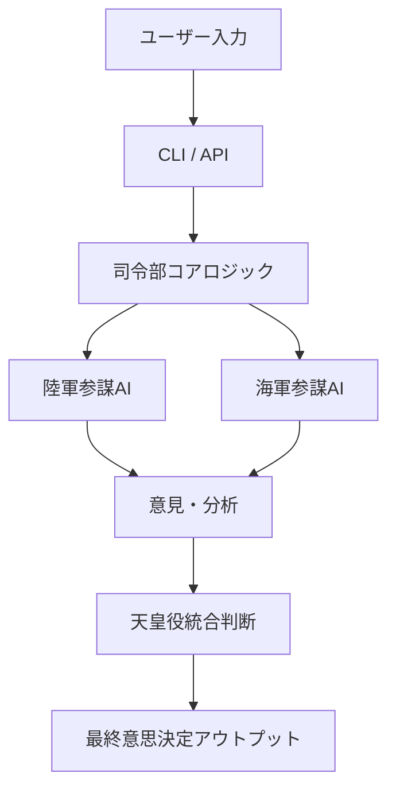

# Project GOZEN



---

## 🚀 プロジェクト概要

**Project GOZEN** は、複数のAIエージェント（陸軍参謀・海軍参謀・統合司令部など）を役割分担させ、
人間の意思決定プロセスを構造的に再現・強化するための実験的フレームワークです。

単一AIに依存するのではなく、**対立・統合・合議**という人間的なプロセスをAI上に再構築することで、
より高品質で説明可能な意思決定を目指します。

---

## ✨ 特徴

- 🧠 **マルチエージェント設計**：陸軍・海軍・統合司令部という役割分担モデル
- ⚖️ **対立構造の明示化**：異なる視点を衝突させ、思考の偏りを抑制
- 🛠️ **CLI & API対応**：スクリプト・自動化・拡張が容易
- 📜 **監査・ログ機構**：意思決定プロセスの追跡と再現が可能
- 🔐 **セキュア設計**：APIキーは `.env` 管理

---

## 🏗️ アーキテクチャ構成

```text
Project-GOZEN/
├── gozen/              # コアロジック
│   ├── api_client.py  # 外部AI API連携
│   ├── audit.py       # 監査・ログ機構
│   ├── character.py   # 各AI役割の定義
│   ├── cli.py         # CLIインターフェース
│   └── __main__.py    # エントリーポイント
├── scripts/           # 運用支援スクリプト
├── tasks/             # サンプルタスク定義
├── .env.template      # 環境変数テンプレート
├── requirements.txt   # 依存関係
└── setup.py           # パッケージ設定
```

---

## 🧪 使用例

```bash
# インストール
pip install -e .

# 実行例
gozen run tasks/sample_arch001.yaml
```

---

## 🎯 想定ユースケース

- 🏗️ システム設計レビューの多角的検証
- 📊 経営判断・戦略立案の意思決定支援
- 🤖 AIオーケストレーション研究
- 📚 教育用途（合議制・組織意思決定モデルの可視化）

---

## 🧭 開発思想

Project GOZEN は、

> 「AIは答えを出す存在ではなく、**思考を構造化する存在**である」

という思想のもとに設計されています。

人間の組織意思決定を模倣することで、
単なる最適化ではなく **納得可能性・説明可能性・対話性** を重視しています。

---

## 🔧 セットアップ

1. リポジトリをクローン
2. `.env.template` を `.env` にコピーしてAPIキーを設定
3. 依存関係をインストール

```bash
pip install -r requirements.txt
```

---

## 📄 ライセンス

このプロジェクトは MIT License のもとで公開されています。

---

## 🙌 クレジット

設計・構想: Tagomori0211
このプロジェクトは以下の記事にインスパイアを受け開発されました。
[Claude Codeで「AI部下10人」を作ったら、勝手にバグ直して「違反は切腹」ルールを追加してきて、オレは適当にしゃべるだけになった](https://zenn.dev/shio_shoppaize/articles/5fee11d03a11a1)

---

## 📈 今後の展望

- Claude / Gemini / OpenAI 複数モデルの同時統合
- 意見重み付けアルゴリズムの進化
- Web UI / ダッシュボード対応
- 意思決定ログの可視化・再学習対応

---

**Project GOZEN は、AIオーケストレーションの実験場であり、
未来の意思決定OSへの一歩です。**

